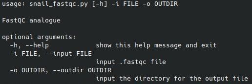

# FastQC-analogue
Implementation of an analogue of the FastQC program <br>

FastQC aims to provide a simple way to do some quality control checks on raw sequence data coming from high throughput sequencing pipelines. It provides a modular set of analyses which you can use to give a quick impression of whether your data has any problems of which you should be aware before doing any further analysis. You can find more information here: https://www.bioinformatics.babraham.ac.uk/projects/fastqc/ <br>

The goal is to implement the programm which is analoge of the FastQC <br>

My team name is Lonely Snail. The only participant is Kravchuk Ekaterina (telegram: @kate_the_snail). <br>


The script was tested on Ubuntu 21.04, Python 3.9.7

## The instructions for the programm

The file requirements.txt contains a list of libraries, necessary to launch the file snail_fastgc.py. <br>
snail_fastqc works only with .fastqc files.

The programm does not support colorspace data. Please, convert it to base calls before use. <br>
<br>
1) Download snail_fastqc.py and requirements.txt <br>

2) If you don't have the library for creating virtual environments, install it 
```bash
python -m pip install virtualenv
```

3) Create the virtual environment 
```bash
python -m virtualenv any_name
```

4) Activate the virtual environment
```bash
source any_name_that_you_like/bin/activate
```

5) Install packages listed in the file requirements.txt 
```bash
python -m pip install -r requirements.txt
```

6) Finally launch snail_fastqc.py

```bash
python snail_fastqc.py --i (--input) input_file.fastq -o (--outdir) dir_to_save_output/
```
### Here is the help message for the programm:


## The output

The programm outputs the following files:
1) input_file_name_Basic_Statistics.tsv

### Basic Statistics
The data contains in input_file_name_Basic_Statistics.tsv. <br>
In the file you can find information about the input file name, file type, encoding, sequence length ang gc content.

